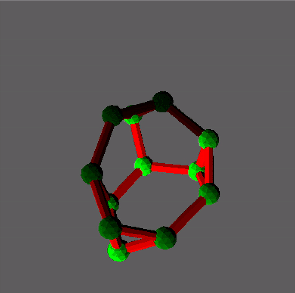

# nx3d

The missing 3D plotting functionality for the excellent `networkx` Python package.



# Installation
In your shell:
```sh
pip install nx3d
```

# Test
In your Python REPL:
```python
import nx3d
nx3d.demo()
```

# Usage
In your Python code:
```python
import networkx as nx
import nx3d

g = nx.frucht_graph()
nx3d.plot(g)
```

For more customization, use the `nx3d.plot_nx3d()` function.

# Contribute
Thank you for considering contributing to `nx3d`.

Currently, there's no testing or enforced formatting with CI to keep this young project lightweight.
With that in mind, the pre-commit hooks defined in `.pre-commit-config.yaml` apply linting and formatting to keep the
project clean. Please use the pre-commit hooks before making a PR.

## Set up pre-commit
From this project's root, initialize pre-commit as follows:

```sh
pre-commit install
pre-commit run -a
```
