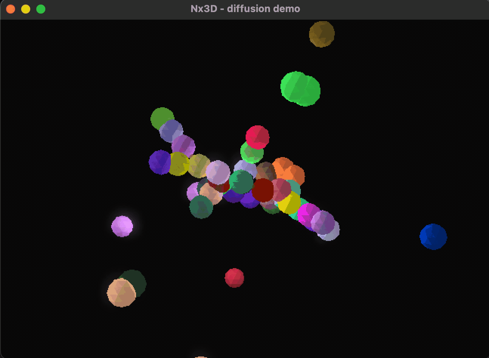

Examples
========

These examples show ways to render temporal graph processes in 3D. View the source code for each example to learn more.
The simplest place to start is ``diffusion``.

.. autofunction:: nx3d.examples.diffusion.diffusion

.. image:: data/watt_diffusion.gif
   :width: 100%

.. autofunction:: nx3d.examples.gameoflife.game_of_life

.. image:: data/gol.gif
   :width: 100%

.. autofunction:: nx3d.examples.keyboard_control.keyboard_control
