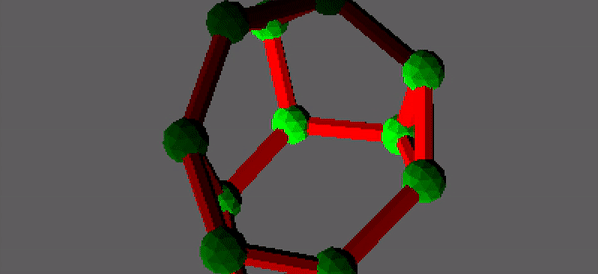

.. nx3d documentation master file, created by
   sphinx-quickstart on Thu Sep 15 08:31:15 2022.
   You can adapt this file completely to your liking, but it should at least
   contain the root `toctree` directive.

Welcome to nx3d's documentation!
================================

``nx3d`` provides interactive, extensible 3D plotting functionality for the ``networkx`` Python package.

The `project homepage <https://github.com/ekalosak/nx3d>`_ has quickstart instructions.

Alternatives
------------------------------------

There are several alternative 3D plotting tools for networkx graphs.
You may find your solution among these.

Using matplotlib
~~~~~~~~~~~~~~~~~~~~~~~~~~~~~~~~~~~~~~~~~

- https://networkx.org/documentation/stable/auto_examples/3d_drawing/plot_basic.html#sphx-glr-auto-examples-3d-drawing-plot-basic-py

Using plotly
~~~~~~~~~~~~~~~~~~~~~~~~~~~~~~~~~~~~~~~~

- https://plotly.com/python/v3/3d-network-graph/
- https://deepnote.com/@deepnote/3D-network-visualisations-using-plotly-a18c5e37-a517-4b27-bfde-1fee94a5760f
- https://towardsdatascience.com/visualize-high-dimensional-network-data-with-3d-360-degree-animated-scatter-plot-d583932d3693

Using Mayavi2
~~~~~~~~~~~~~~~~~~~~~~~~~~~~~~~~~~~~~~~~

- https://networkx.org/documentation/stable/auto_examples/3d_drawing/mayavi2_spring.html

So why another one?
~~~~~~~~~~~~~~~~~~~~~~~~~~~~~~~~~~~~~~~~
Because none of the alternatives are built on a 3D game engine. This design choice provides ``nx3d`` with an
embarassment of flexibility.

Hello world, start here
------------------------------------
Install with ``pip install nx3d``.
Check your installation with ``python -m nx3d autolabel``.
Use in your code like ``nx3d.plot(nx.tetrahedral_graph())``.
See the :doc:`usage` and :doc:`examples` pages next.

Known limitations
------------------------------------

large graphs
~~~~~~~~~~~~~~~~~~~~~~~~~~~~~~~~~~~~~~~~
Graphs with more than 500 nodes may degrade the frame-rate on older computers.
Try ``nx3d.plot(nx.random_lobster(100,.9,.9))`` to get a sense of how performance scales on your system.

render attributes
~~~~~~~~~~~~~~~~~~~~~~~~~~~~~~~~~~~~~~~~
``nx3d`` doesn't have all the same controls that Matplotlib does (yet). While you can set size, label, color, and
position - some attributes like marker kind aren't yet available. See
`this milestone <https://github.com/ekalosak/nx3d/milestone/3/>`_ for progress on these features.

threading
~~~~~~~~~~~~~~~~~~~~~~~~~~~~~~~~~~~~~~~~
The networkx graph controling the render state is singular, but it has no synchronization primitives. See Panda3D's docs
on threading if you need this functionality.

Code of Conduct
------------------------------------
`Contributor Covenant <https://www.contributor-covenant.org/version/2/1/code_of_conduct/>`_

.. toctree::
   :maxdepth: 1
   :caption: Contents:

   install
   support
   examples
   usage
   api
   contribute
